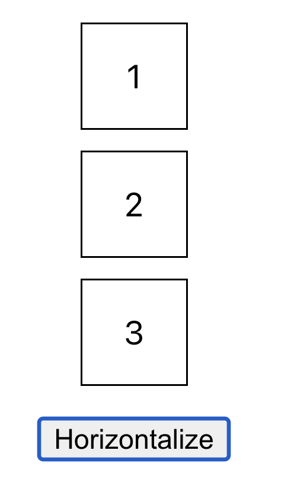
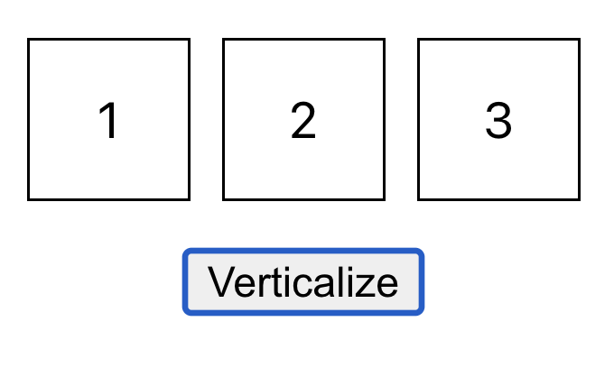

# MIU-CS568-2023-09-Assignment02
# Assignment 02: Using React to implement a simple box rotation app which has the following components
1. Box: Display a box with a label as a number that this component receives by props
2. BoxList: Contains all the boxes with a button which can rotate all boxes vertically or horizontally 
3. App: Contains the BoxList
## Please use flexbox to position items
## Please refer to the following images
 
